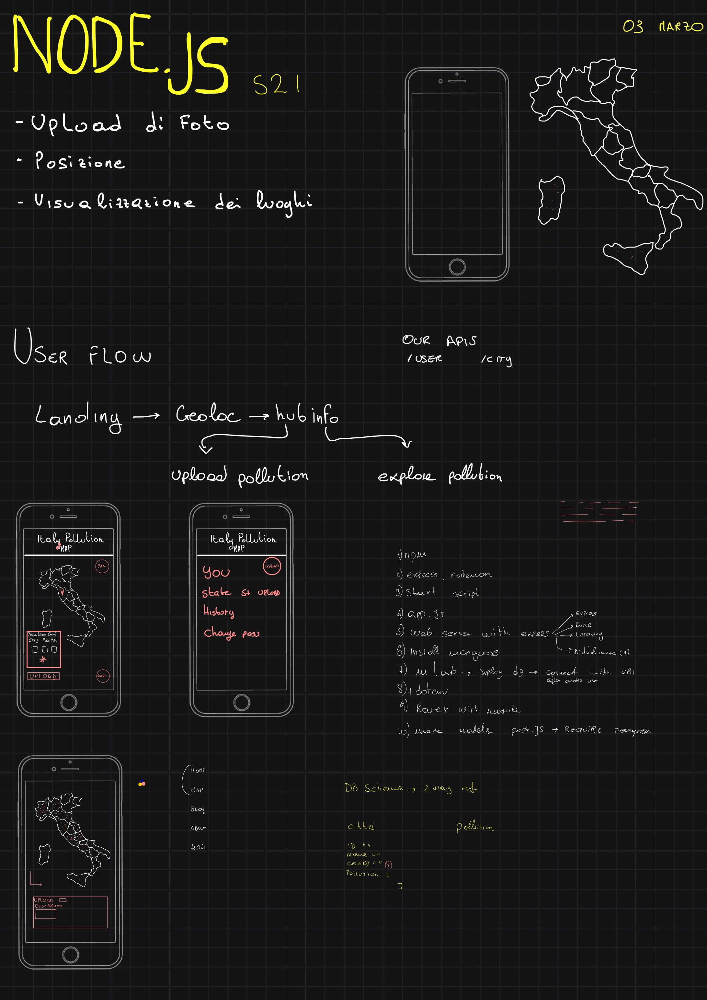
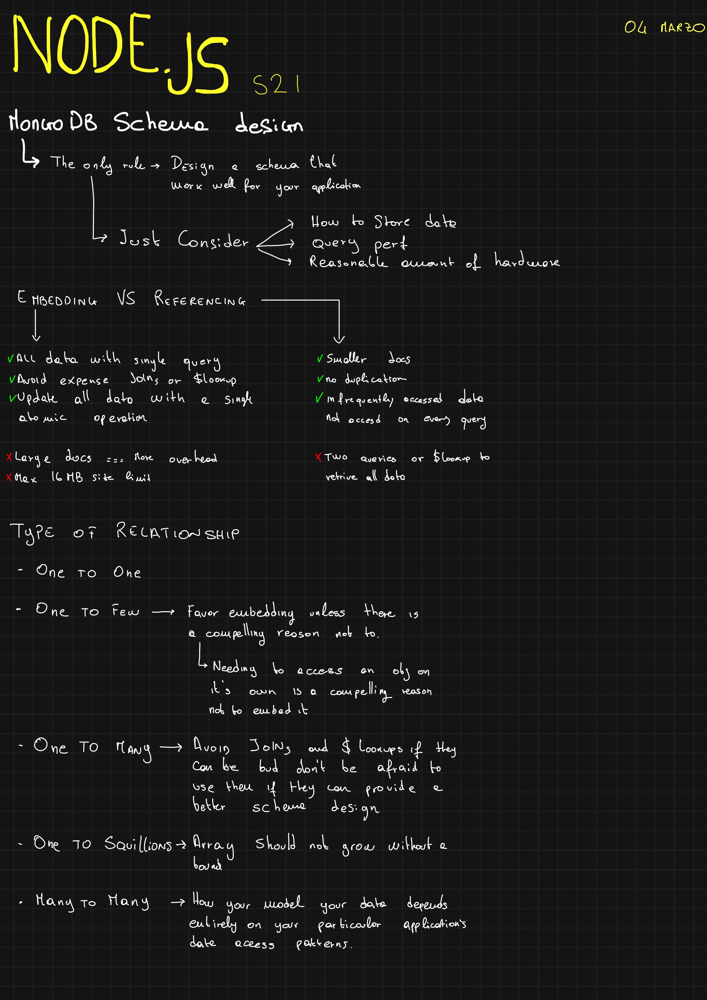
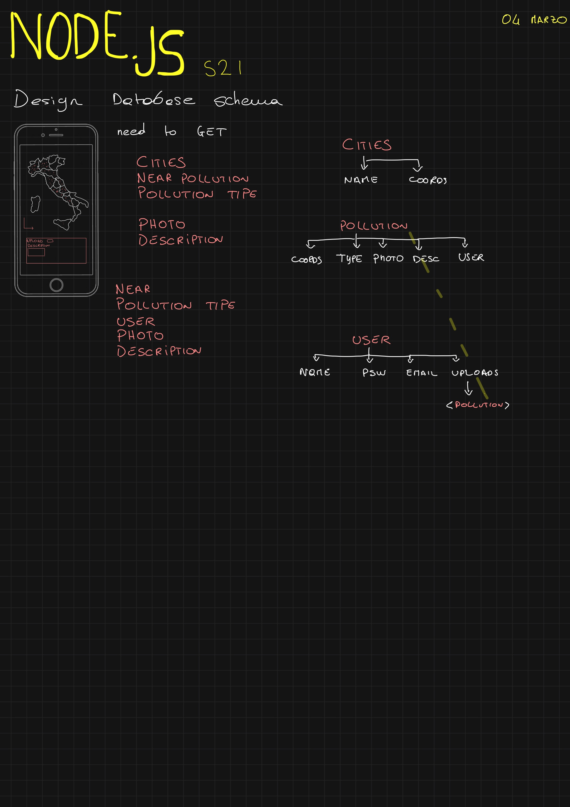
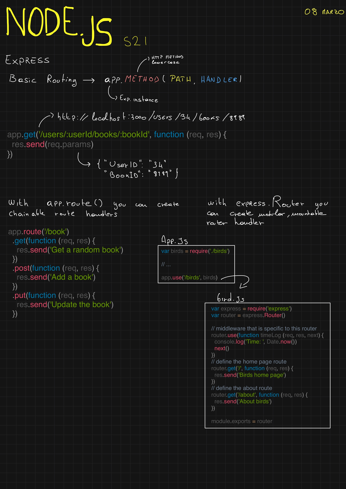
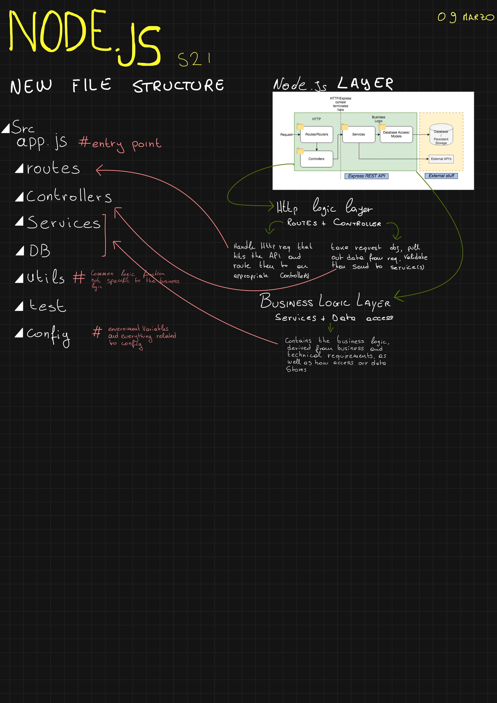
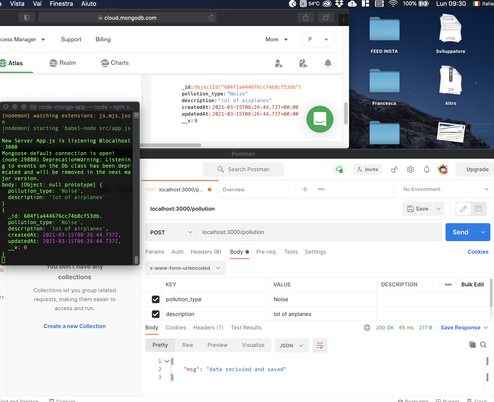

# App Journey #1

Hi! 👋  
I'm Pablo, in this repository i'm going to record my entire process of creating a web app for the start2impact node.js project, follow me in this journey! 

### Table of Contents

- [Description](#description)
- [Rules](#rules)
- [The Project](#the-project)
- [Day Zero](#day-0)
- [About Me](#about-me)


## Rules

I'll try to commit every day with more data possibile, like hours spent, which source i've used, how far the code went and etcetera etcetera. 

## The Project

The project is pretty simple, i have to build a Node.js app which helps to report polluted place near your geolocalization. Isn't required a UI, but is required to build APIs, make possible photo upload to show the pollution and upload the coords.

---

### Day 0

📅 **Date:** 03 March  
The first day of working, just planning and looking source around. Just try to sketch the app and his function



⌛ *Hours Spent:* 2

### Day 1

📅 **Date:** 04 March  
i've started to lay down a plan for the app, initialized folder, installed some packages and made a basic routing. 

I've studied how to *design schemas* in MongoDB and i leave you two usefull resource:  
[📝 - 6 Thumb Rules for Schema Design](https://www.mongodb.com/blog/post/6-rules-of-thumb-for-mongodb-schema-design-part-1)  
[📺 - Mongo DB Best Practice](https://www.youtube.com/watch?v=leNCfU5SYR8&t=2715s)  


  
  


Then i sketched out the first sample of schemas that you can find in sample.js and i've searched how to find the nearest location in using the coords of cites and photos, stackoverflow gave me an [hint!](https://stackoverflow.com/questions/36534879/how-to-find-data-of-nearest-location-from-mongodb-collection-using-mongoose)

⌛ *Hours Spent:* 3

### Day 2  

📅 **Date:** 05 March

Today i've tried to bring in my code a little more *consistency*, this morning i wasn't very productive so i need a way too better evaluate my effort. So i've searched a common way to build RESTful App with Node.js and guess what?  

🥁🥁🥁  

No rules, no common ways, everyone have his personal method to build it. But after a while i've found @rwieruch and his series of tutorial. I've really enjoied that tuts because he's not explain a walktrought, as everyone else, but he's explay the entire system, so give a look to these tuts! 

[1 - The minimal Node.js with Babel and Nodemon](https://www.robinwieruch.de/minimal-node-js-babel-setup/)  
[2 - Setup Express.js](https://www.robinwieruch.de/node-js-express-tutorial/)  
[3 - Create REST APIs](https://www.robinwieruch.de/node-express-server-rest-api/)  
[4 - Setup the DB with MongoDB](https://www.robinwieruch.de/mongodb-express-setup-tutorial/)  
[5 - Node, Express and MongoDB](https://www.robinwieruch.de/mongodb-express-node-rest-api)  

This series of tuts was what i needed, a *fil rouge* between everything. As you can see in the first two days, working by myself, I didn't work smart and this morning i've felt this, so reading *Robin Wieruch* gave my work more consistency, and you can clarily see how i've shifted my code. So now the plan for the next daysss:  

* Implementing better routing
* Implementing modular routing
* Connecting MongoDB 

**What I've learned today:** Using babbel is useful for implmenting ECMAScript that aren't support with Node, deepen the routing process with express, first approach wirh curl & deepen CRUD request. 

See ya tomorrow!

⌛ *Hours Spent:* 4

### Day 3

📅 **Date:** 08 March  
Finished @rwieruch tuts. So now i have a clear plan on how to go on by myself. Was very useful reading the [Expess advanced routing](https://expressjs.com/en/guide/routing.html) article on Express.js docs. Here some notes: 

  

Not much to say anymore, for tomorrow i plan to:  
* Set the complete file tree
* Continuing reading Multer for implementing photo uploading
* Code APIs and Schema i need for this project

**What I've learned today:** I finally get a full overview on how a RESTful API App works, Advanced and Module routing with express, handling error in api request, some new query with Mongoose.

⌛ *Hours Spent:* 3

### Day 4

📅 **Date:** 09 March  
Today was about learning how to have a correct and useful folder hierarchy, difference between <code>import</code> and <code>request</code>, learning something about [validation](https://mongoosejs.com/docs/validation.html), understanding [CORS](https://developer.mozilla.org/it/docs/Web/HTTP/CORS) and his node [package](https://www.npmjs.com/package/cors) and how to make server able to allow every request so i could make an index.html with a fetch request and finally read about Multer.

Btw the most time consuming part was learning how to correctly implement a beautiful and useful folder and file hierarchy. It's pretty useful understand how a Node.js RESTful API app should be *"layered"*, i've read a lot of articles but [this one](https://www.coreycleary.me/project-structure-for-an-express-rest-api-when-there-is-no-standard-way) was the one which explain better how to build a solid, scalable and testable boilerplate for your RESTful app. 

  

So with my notes in mind for tomorrow i plan to:
* 🏗️ correct the actual hierarchy of my file, dividing them into modules
* 💾 implement every api i need based on user flow of the site
* 🔎 maybe authentication 

⌛ *Hours Spent:* 4h 45m

### Day 5

📅 **Date:** 10 March  
Today was very hard 🥵, i've passed most of time coding new routes and mongoose schema and modules, i've not finished yet probably i'm going to finish tomorrow all the *business logic* (hopefully). In this commit I've also delete the src folder and make a new one, to clear this repo. 

The plain for tomorrow is the same of yesterday:

* 🏗️ Finish the Business Logic
* 💾 implement every api i need based on user flow of the site 
* 📤 implement photo upload with [Multer](https://www.geeksforgeeks.org/upload-and-retrieve-image-on-mongodb-using-mongoose/)

⌛ *Hours Spent:* 4h

### Day 6

📅 **Date:** 11 March  
Nothing changed from yesterday. Still stuggling with the business logic. I've tried to do the first POST request for poulate the db with a new City but it doesen't work, probably I'm wrong with embedding GeoSchema in the other models!

If I can get where i'm wrong with this tomorrow I'll be able to start routing an controllers to complete the APIs.

More or less I'll stick to the plan:

* 🏗️ Finish the Business Logic
* 💾 implement every api i need based on user flow of the site 
* 📤 implement photo upload with [Multer](https://www.geeksforgeeks.org/upload-and-retrieve-image-on-mongodb-using-mongoose/)

⌛ *Hours Spent:* 3h 30m 

### Day 7

📅 **Date:** 12 March  
Struggling with router.post and importing and exporting with ES6. I've decided to use default Node.js method for importing and exporting modules because atm i can't understand how correctly import and export modules and schema. Furthermore i'm struggling with save data on MongoDB and probably i'm wrong the mongoose query, because i thing i can save on the db whit .create(req.body).

No plan for the weekend! I just need to figure out how to save data on database with a post request and then continue with the api development!


⌛ *Hours Spent:* 4h 

### Day 8

📅 **Date:** 15 March  
Finally I was able to send data correctly to the database!

  

First thing first I need to say that I get some trouble with Postman because I couldn't send raw body with post request, don't know why but the body of the request made with Postman was every time empty, so I decided to use curl: 
``` 
curl -d '{
    "name": "Lucchio",
    "geometry" : { "type": "point", "coordinates": [44.037,10.7165]
    }
  }' -H 'Content-Type: application/json' http://localhost:3000/cities
```
With curl I succed to send data but I had another error with MongoDB that i resolved deleting the ``` &w=majority``` from the MongoDb connection link. From there everything worked fine and i was able to send data with post request also with Postman using the ``` x-www-form-urlencoded``` tab instead the ```raw``` tab.

Regarding the request code, I've changed the Mongoose method to ```.save()``` because the wrap also the ```.create()``` but i think that the major error was the two said before. I've also change the error handling with a callback and that's the result!

```
router.post('/', (req, res, next) => {
  console.log('body:', req.body)
  const newCity = new City(req.body)
  newCity.save((err, doc) => {
    if (err) console.log(err)
    else {
      console.log(doc)
      return res.json({
        msg: 'data recivied and saved'
      })
    }
  })
})
```
From there I've started to build a complete router sistem and i've to finish it. Probably from tomorrow I'm starting to separate *router* from *controllers* to have a more clean code. And that's all folks! Seee you tomorrow!!

* 🏗️ Finish the Business Logic

⌛ *Hours Spent:* 2h 45m 

### Day 9

📅 **Date:** 16 March  
Not a productive day! I've start to make some template with ejs just to move my mind from controllers and router. 
I think I'm going to do a render, then the router and finally the controller just to not get out crazy 🤯

So the plan is the same of the last week more or less ahaha

* 🏗️ Continue the Business Logic
* 🖼️ Make components and some css and contine with templating the other pages 


⌛ *Hours Spent:* 1h 30m 


***TOTAL HOURS:*** 32h 30m
---


## About Me

- Instagram - [@pablomicheletti](https://www.instagram.com/pablomicheletti/)
- Website - [PabloMicheletti](http://pablomicheletti.it)
