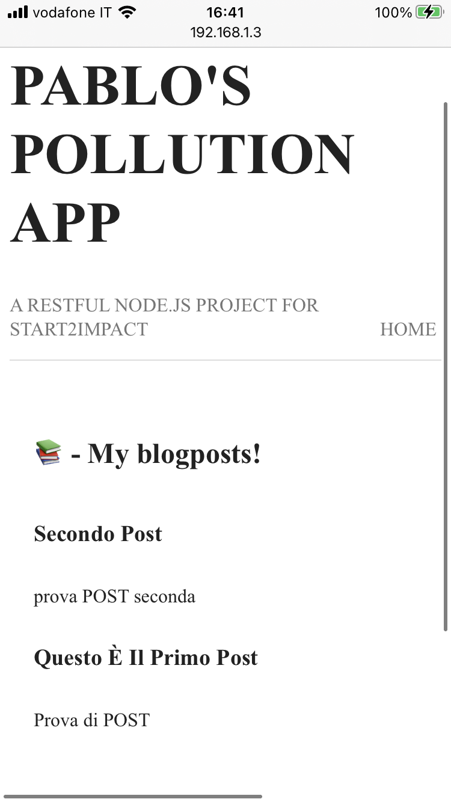
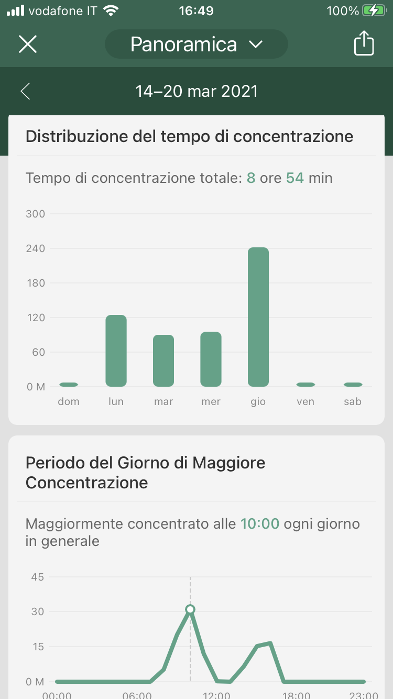

# App Journey #1

Hi! 👋  
I'm Pablo, in this repository i'm going to record my entire process of creating a web app for the start2impact node.js project, follow me in this journey! 

### Table of Contents

- [Description](#description)
- [Rules](#rules)
- [The Project](#the-project)
- [Day Zero](#day-0)
- [Side Notes](#side-notes)
- [About Me](#about-me)


## Rules

I'll try to commit every day with more data possibile, like hours spent, which source i've used, how far the code went and etcetera etcetera. 

## The Project

The project is pretty simple, i have to build a Node.js app which helps reporting polluted places/areas near you with the help of geolocalization. Isn't required a UI, but is required to build APIs, make possible photo upload to show the pollution and upload the coords.

---

### Day 0

📅 **Date:** 03 March  
The first day of working, just planning and looking source around. Just try to sketch the app and his function


⌛ *Hours Spent:* 2

### Day 1

📅 **Date:** 04 March  
i've started to lay down a plan for the app, initialized folder, installed some packages and made a basic routing. 

I've studied how to *design schemas* in MongoDB and i leave you two usefull resource:  
[📝 - 6 Thumb Rules for Schema Design](https://www.mongodb.com/blog/post/6-rules-of-thumb-for-mongodb-schema-design-part-1)  
[📺 - Mongo DB Best Practice](https://www.youtube.com/watch?v=leNCfU5SYR8&t=2715s)  


  
  


Then i sketched out the first sample of schemas that you can find in sample.js and i've searched how to find the nearest location in using the coords of cites and photos, stackoverflow gave me an [hint!](https://stackoverflow.com/questions/36534879/how-to-find-data-of-nearest-location-from-mongodb-collection-using-mongoose)

⌛ *Hours Spent:* 3

### Day 2  

📅 **Date:** 05 March

Today i've tried to bring in my code a little more *consistency*, this morning i wasn't very productive so i need a way too better evaluate my effort. So i've searched a common way to build RESTful App with Node.js and guess what?  

🥁🥁🥁  

No rules, no common ways, everyone have his personal method to build it. But after a while i've found @rwieruch and his series of tutorial. I've really enjoied that tuts because he's not explain a walktrought, as everyone else, but he's explay the entire system, so give a look to these tuts! 

[1 - The minimal Node.js with Babel and Nodemon](https://www.robinwieruch.de/minimal-node-js-babel-setup/)  
[2 - Setup Express.js](https://www.robinwieruch.de/node-js-express-tutorial/)  
[3 - Create REST APIs](https://www.robinwieruch.de/node-express-server-rest-api/)  
[4 - Setup the DB with MongoDB](https://www.robinwieruch.de/mongodb-express-setup-tutorial/)  
[5 - Node, Express and MongoDB](https://www.robinwieruch.de/mongodb-express-node-rest-api)  

This series of tuts was what i needed, a *fil rouge* between everything. As you can see in the first two days, working by myself, I didn't work smart and this morning i've felt this, so reading *Robin Wieruch* gave my work more consistency, and you can clarily see how i've shifted my code. So now the plan for the next daysss:  

* Implementing better routing
* Implementing modular routing
* Connecting MongoDB 

**What I've learned today:** Using babbel is useful for implmenting ECMAScript that aren't support with Node, deepen the routing process with express, first approach wirh curl & deepen CRUD request. 

See ya tomorrow!

⌛ *Hours Spent:* 4

### Day 3

📅 **Date:** 08 March  
Finished @rwieruch tuts. So now i have a clear plan on how to go on by myself. Was very useful reading the [Expess advanced routing](https://expressjs.com/en/guide/routing.html) article on Express.js docs. Here some notes: 

  

Not much to say anymore, for tomorrow i plan to:  
* Set the complete file tree
* Continuing reading Multer for implementing photo uploading
* Code APIs and Schema i need for this project

**What I've learned today:** I finally get a full overview on how a RESTful API App works, Advanced and Module routing with express, handling error in api request, some new query with Mongoose.

⌛ *Hours Spent:* 3

### Day 4

📅 **Date:** 09 March  
Today was about learning how to have a correct and useful folder hierarchy, difference between <code>import</code> and <code>request</code>, learning something about [validation](https://mongoosejs.com/docs/validation.html), understanding [CORS](https://developer.mozilla.org/it/docs/Web/HTTP/CORS) and his node [package](https://www.npmjs.com/package/cors) and how to make server able to allow every request so i could make an index.html with a fetch request and finally read about Multer.

Btw the most time consuming part was learning how to correctly implement a beautiful and useful folder and file hierarchy. It's pretty useful understand how a Node.js RESTful API app should be *"layered"*, i've read a lot of articles but [this one](https://www.coreycleary.me/project-structure-for-an-express-rest-api-when-there-is-no-standard-way) was the one which explain better how to build a solid, scalable and testable boilerplate for your RESTful app. 

  

So with my notes in mind for tomorrow i plan to:
* 🏗️ correct the actual hierarchy of my file, dividing them into modules
* 💾 implement every api i need based on user flow of the site
* 🔎 maybe authentication 

⌛ *Hours Spent:* 4h 45m

### Day 5

📅 **Date:** 10 March  
Today was very hard 🥵, i've passed most of time coding new routes and mongoose schema and modules, i've not finished yet probably i'm going to finish tomorrow all the *business logic* (hopefully). In this commit I've also delete the src folder and make a new one, to clear this repo. 

The plain for tomorrow is the same of yesterday:

* 🏗️ Finish the Business Logic
* 💾 implement every api i need based on user flow of the site 
* 📤 implement photo upload with [Multer](https://www.geeksforgeeks.org/upload-and-retrieve-image-on-mongodb-using-mongoose/)

⌛ *Hours Spent:* 4h

### Day 6

📅 **Date:** 11 March  
Nothing changed from yesterday. Still stuggling with the business logic. I've tried to do the first POST request for poulate the db with a new City but it doesen't work, probably I'm wrong with embedding GeoSchema in the other models!

If I can get where i'm wrong with this tomorrow I'll be able to start routing an controllers to complete the APIs.

More or less I'll stick to the plan:

* 🏗️ Finish the Business Logic
* 💾 implement every api i need based on user flow of the site 
* 📤 implement photo upload with [Multer](https://www.geeksforgeeks.org/upload-and-retrieve-image-on-mongodb-using-mongoose/)

⌛ *Hours Spent:* 3h 30m 

### Day 7

📅 **Date:** 12 March  
Struggling with router.post and importing and exporting with ES6. I've decided to use default Node.js method for importing and exporting modules because atm i can't understand how correctly import and export modules and schema. Furthermore i'm struggling with save data on MongoDB and probably i'm wrong the mongoose query, because i thing i can save on the db whit .create(req.body).

No plan for the weekend! I just need to figure out how to save data on database with a post request and then continue with the api development!


⌛ *Hours Spent:* 4h 

### Day 8

📅 **Date:** 15 March  
Finally I was able to send data correctly to the database!

  

First thing first I need to say that I get some trouble with Postman because I couldn't send raw body with post request, don't know why but the body of the request made with Postman was every time empty, so I decided to use curl: 
``` 
curl -d '{
    "name": "Lucchio",
    "geometry" : { "type": "point", "coordinates": [44.037,10.7165]
    }
  }' -H 'Content-Type: application/json' http://localhost:3000/cities
```
With curl I succed to send data but I had another error with MongoDB that i resolved deleting the ``` &w=majority``` from the MongoDb connection link. From there everything worked fine and i was able to send data with post request also with Postman using the ``` x-www-form-urlencoded``` tab instead the ```raw``` tab.

Regarding the request code, I've changed the Mongoose method to ```.save()``` because the wrap also the ```.create()``` but i think that the major error was the two said before. I've also change the error handling with a callback and that's the result!

```
router.post('/', (req, res, next) => {
  console.log('body:', req.body)
  const newCity = new City(req.body)
  newCity.save((err, doc) => {
    if (err) console.log(err)
    else {
      console.log(doc)
      return res.json({
        msg: 'data recivied and saved'
      })
    }
  })
})
```
From there I've started to build a complete router sistem and i've to finish it. Probably from tomorrow I'm starting to separate *router* from *controllers* to have a more clean code. And that's all folks! Seee you tomorrow!!

* 🏗️ Finish the Business Logic

⌛ *Hours Spent:* 2h 45m 

### Day 9

📅 **Date:** 16 March  
Not a productive day! I've start to make some template with ejs just to move my mind from controllers and router. 
I think I'm going to do a render, then the router and finally the controller just to not get out crazy 🤯

So the plan is the same of the last week more or less ahaha

* 🏗️ Continue the Business Logic
* 🖼️ Make components and some css and contine with templating the other pages 


⌛ *Hours Spent:* 1h 30m 


### Day 10

📅 **Date:** 18 March  

I finally can see the light!💡 
It's pretty awful coding without a feedback on what are you doing, so two days ago starting with EJS i went right! Doing the first views of the app and make them interact with the APIs I'm creating was a boost of productivity and determiantion. 

So what I've done is essentially the implementation with EJS, doing also some styiling with css (but i don't like it, in the next days i'm going to do something different) and I've added a Blog section and I've completed all the APIs needed. I'm on a good way and in a good mood, I think that i'll need 2 or 3 days more to complete the app! 

Here some screenshot from my Iphone of the app:  




⌛ *Hours Spent:* 4h 

### Day 11

📅 **Date:** 19 March  

Nothing much different from yesterday, I'm continuing to build the business logic and make all the routing with the views. In the last two hours I've started to take a deep look to multer and check how i can implement it. The bigger problem I had, was that i couldn't find any example of multer integration with an existing schema and I'm still searching how to do the POST request with the file upload and the body upload, to make the complete *pollution card*.

That's all for today.

To do list:
* 🏗️ Continue the Business Logic
* 🤿 Deepen the *file upload* and *authentication* method, for implement them next week
* 🖼️ Sketch some css to make al nicer

⌛ *Hours Spent:* 4h 

### Day 12

📅 **Date:** 22 March  

*Habemus uploads!* Yay, that's it, with multer now i'm able to upload photo up to 5 MB to the server. I found out that it's also possible to upload photo directly to the DB but i'll drop it, for now. I resolved the problem of *day 11* with a simple call back
```
// Pollution Upload by POST
router.post('/upload', upload.single('photoInput'), pollutionController.pollution_upload_post)
```
Then i moved on a new **task**: append coordinates to the photo using a botton that enable geolocatio. Seems really simple, and it is but i have the problem that the connection in localhost block the browser's geolocation APIs. I could drop it too but i decided to deploy the app with Ngnix to my DigitalOcean server. 

So se you tomorrow with server side updates! 

To do list:
* 🏗️ Continue the Business Logic (Pollution, User)
* 🖥️ Deploy the app with Ngnix 
* 🤿 Deepen *authentication* method, because is not hard enough yet
* 🖼️ Sketch some css to make all nicer

⌛ *Hours Spent:* 4h (but with this readme too, so for today let's consider just 3h and 30m) 

### Day 13

📅 **Date:** 29 March  

Hiiii Fellas! Was a huuuuge week, i didn't code so much so let's start this week in the right way. First thing first a huge ToDo list i've made: 

To do list:
* 🍥 Make Routing Version: /api/v1/'api name'
* 🔎 Implement Schema Validation Object with mongoose (Almost done)
* 🏗️ Pollution APIs:
  * ~GET~
  * ~POST~
  * ~DELETE~
  * UPDATE -> Can't make it work, gave the resault on a different id
* 📺 Pollution RENDER:
  * ~GET all and speccific~
  * ~POST~
  * ~DELETE~
  * UPDATE
*  🏗️ Cities APIs:
  *  ~Make controllers~
  *  ~GET (Cities list)~
*  📺  Cities RENDER
  *  GET (Cities list) searching a good way to show all the cities and the nearest pollution
* 📊 Find a way to show nearest pollution
* 🏗️  User APIs:
  * GET (userlist)
  * POST (singup) 
    * Delete pass from post
    * Hash the password
  * POST (login)
    * bcrypt.compare
    * validationToken 
  * DELETE (:id)
* 📺  User RENDER:
  * GET (userlist)
  * POST (singup) 
    * Delete pass from post
    * Hash the password
  * POST (login)
    * bcrypt.compare
    * validationToken 
  * DELETE (:id)
* 🖥️ Deploy the app with Ngnix
  * Almost done
* 🤿 Deepen *authentication* method, because is not hard enough yet
* 🖼️ Sketch some css to make all nicer

This morning i've almost complete the Api's for pollution but i had a problem with the update, i don't know why but when i make the request from postman on a specific `id` the update works but on another `ìd`. In the last hour i've looking for a method to show the pollution to the user, probably i'm going to use d3. 

See ya tomorrow!


⌛ *Hours Spent:*  4h

### Day 13

📅 **Date:** 1 April  

I've Finished the app!!!...
Ok no, i've just finished to implement users and token validation, tomorrow i'm going to learn how to use cookies to remember user's token in the browser to acced the
protected areas of the website.  

To do list:
* 🍥 Make Routing Version: /api/v1/'api name'
* 🔎 Implement Schema Validation Object with mongoose (Almost done)
* 🏗️ Pollution APIs:
  * ~GET~
  * ~POST~
  * ~DELETE~
  * UPDATE -> Can't make it work, gave the resault on a different id
* 📺 Pollution RENDER:
  * ~GET all and speccific~
  * ~POST~
  * ~DELETE~
  * UPDATE
*  🏗️ Cities APIs:
  *  ~Make controllers~
  *  ~GET (Cities list)~
*  📺  Cities RENDER
  *  GET (Cities list) searching a good way to show all the cities and the nearest pollution
* 📊 Find a way to show nearest pollution
* 🏗️  User APIs:
  * ~GET (userlist)~
  * ~POST (singup)~ 
    * ~Delete pass from post~
    * ~Hash the password~
  * ~POST (login)~
    * ~bcrypt.compare~
    * ~validationToken~
  * DELETE (:id)
* 📺  User RENDER:
  * ~GET (usersingup)~ 
  * ~POST (userlogin)~
  * DELETE (:id)
* 🖥️ Deploy the app with Ngnix
  * Almost done
* 🤿 Deepen *authentication* method, because is not hard enough yet
* 🖼️ Sketch some css to make all nicer


See ya tomorrow!


⌛ *Hours Spent:*  4h


***TOTAL HOURS:*** 52h
---

## Side Notes

### How to stay focused

I just want to add some suggestion here, to study consistently. I've found it pretty difficult and I want to share with you how I can get focused for 2 hours straight. I use an app calld Forest, it's very helpful for me because with it i can track my activities and i can stay focused without many distracion.  



  

I usually make session of 2 hours but you can choose the time amount you prefer. And the best thing have this app is the *iperfocus* mode, it means that you can't exit the app or the little tree will dead.

  

Why i want to share this tips with you? Because in the last week I'm not felt very productive and many times I thought that I'm wasting time. I wasn't using the app in the *iperfocus* mode and very often i took the phone and got distracting. So today i've restarting to use the app in *iperfocus* mode and i felt a lot more productive and i think that i was very productive, because i've been always focused on the app and the 4 hours of today flew away! So what i want to say is:

> It's better to stay focused for a little time than works a lot of hours distracted.

Hope u'll find my tips usefull and if you're going to download the app here's is my redeem code to have some little money to buy a little tree! 🌲  

* 📱 - https://forestapp.cc/download/it
* 🌻 - 4YAPR9SG

### Digital Ocean referrals

I'll leave here my Digital Ocean referral links so we can help each other to get some online space to deploy our project!

* 🖥️ - https://m.do.co/c/069a6108b50b

---


## About Me

- Instagram - [@pablomicheletti](https://www.instagram.com/pablomicheletti/)
- Website - [PabloMicheletti](http://pablomicheletti.it)
